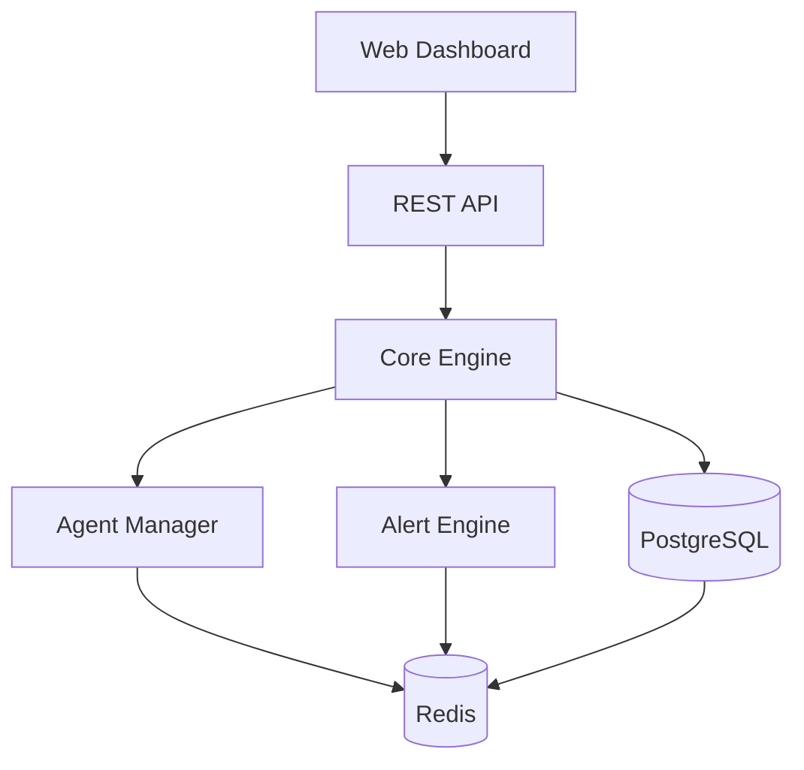
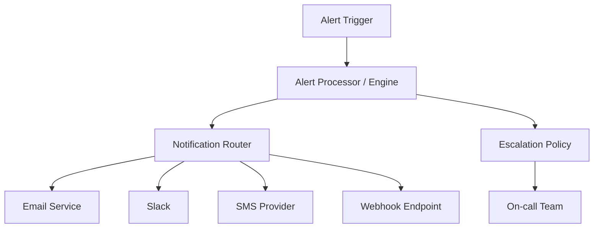
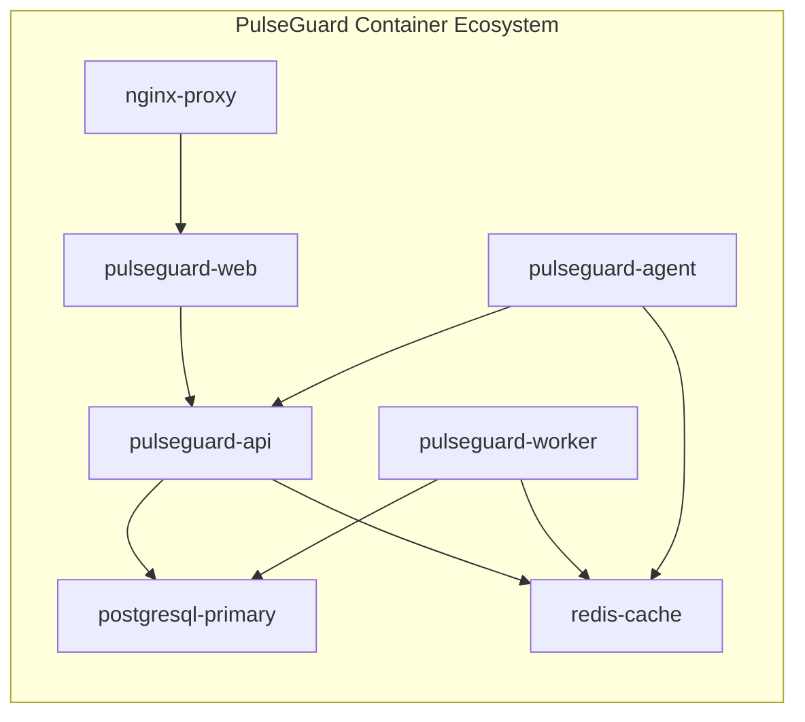
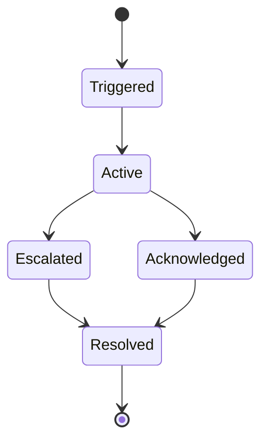

# PulseGuard™ - Mermaid Diagrams

This directory contains Mermaid diagram files and generated images for the PulseGuard™ documentation.

## Available Diagrams

### 1. System Architecture
**File**: `diagrams/system-architecture.mmd`  
**Image**: `images/system-architecture.png`



### 2. Alert Management System
**File**: `diagrams/alert-management.mmd`  
**Image**: `images/alert-management.png`



### 3. Deployment Architecture
**File**: `diagrams/deployment-architecture.mmd`  
**Image**: `images/deployment-architecture.png`



### 4. Alert Lifecycle
**File**: `diagrams/alert-lifecycle.mmd`  
**Image**: `images/alert-lifecycle.png`



## How to Generate Images

### Prerequisites
1. Install Node.js and npm
2. Install Mermaid CLI locally:
```bash
npm install @mermaid-js/mermaid-cli
```

### Generate Individual Images
```bash
# System Architecture
npx mmdc -i diagrams/system-architecture.mmd -o images/system-architecture.png -w 1200 -H 800

# Alert Management
npx mmdc -i diagrams/alert-management.mmd -o images/alert-management.png -w 1200 -H 800

# Deployment Architecture
npx mmdc -i diagrams/deployment-architecture.mmd -o images/deployment-architecture.png -w 1200 -H 800

# Alert Lifecycle
npx mmdc -i diagrams/alert-lifecycle.mmd -o images/alert-lifecycle.png -w 1200 -H 800
```

### Generate All Images (Batch)
```bash
# PowerShell script to generate all diagrams
$diagrams = @(
    "system-architecture",
    "alert-management", 
    "deployment-architecture",
    "alert-lifecycle"
)

foreach ($diagram in $diagrams) {
    npx mmdc -i "diagrams\$diagram.mmd" -o "images\$diagram.png" -w 1200 -H 800
    Write-Host "Generated $diagram.png"
}
```

## Image Formats

### Supported Output Formats
- **PNG**: Default format, good for documentation
- **SVG**: Vector format, scalable
- **PDF**: Print-ready format

### Generate Different Formats
```bash
# PNG (default)
npx mmdc -i diagrams/system-architecture.mmd -o images/system-architecture.png

# SVG
npx mmdc -i diagrams/system-architecture.mmd -o images/system-architecture.svg

# PDF
npx mmdc -i diagrams/system-architecture.mmd -o images/system-architecture.pdf
```

## Customization Options

### Image Dimensions
```bash
# Custom width and height
npx mmdc -i input.mmd -o output.png -w 1600 -H 1200

# Standard sizes
npx mmdc -i input.mmd -o output.png -w 1920 -H 1080  # Full HD
npx mmdc -i input.mmd -o output.png -w 2560 -H 1440  # 2K
```

### Theme Options
```bash
# Dark theme
npx mmdc -i input.mmd -o output.png -t dark

# Light theme (default)
npx mmdc -i input.mmd -o output.png -t default

# Forest theme
npx mmdc -i input.mmd -o output.png -t forest
```

### Background Options
```bash
# Transparent background
npx mmdc -i input.mmd -o output.png -b transparent

# White background (default)
npx mmdc -i input.mmd -o output.png -b white

# Custom color background
npx mmdc -i input.mmd -o output.png -b "#f0f0f0"
```

## Using in Documentation

### Markdown Integration
```markdown

```

### HTML Integration
```html

```

### Documentation.html Integration
The diagrams are automatically processed when viewing `documentation.html`. The Mermaid syntax is rendered live in the browser.

## File Structure
```
docs/
├── diagrams/           # Source Mermaid files
│   ├── system-architecture.mmd
│   ├── alert-management.mmd
│   ├── deployment-architecture.mmd
│   └── alert-lifecycle.mmd
├── images/            # Generated PNG images
│   ├── system-architecture.png
│   ├── alert-management.png
│   ├── deployment-architecture.png
│   └── alert-lifecycle.png
├── README-diagrams.md # This file
└── documentation.html # HTML viewer with live Mermaid rendering
```

## Troubleshooting

### Common Issues

1. **Puppeteer Download Errors**
   ```bash
   # Skip Puppeteer download
   set PUPPETEER_SKIP_DOWNLOAD=true  # Windows CMD
   $env:PUPPETEER_SKIP_DOWNLOAD="true"  # PowerShell
   export PUPPETEER_SKIP_DOWNLOAD=true  # Linux/Mac
   ```

2. **Permission Errors**
   ```bash
   # Run as administrator or use local installation
   npx --yes @mermaid-js/mermaid-cli -i input.mmd -o output.png
   ```

3. **Network Issues**
   ```bash
   # Use offline installation
   npm install @mermaid-js/mermaid-cli --offline
   ```

### Validation
Test your Mermaid syntax online: [Mermaid Live Editor](https://mermaid.live/)

## Additional Resources

- [Mermaid Documentation](https://mermaid.js.org/)
- [Mermaid CLI Documentation](https://github.com/mermaid-js/mermaid-cli)
- [Mermaid Syntax Reference](https://mermaid.js.org/syntax/)